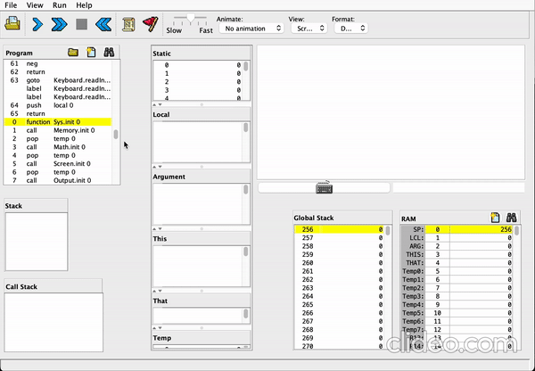

# Nand2Tetris Projects

## ABOUT

Course projects starting from building the HACK virtual machine, all the way up to creating Eliza-like chat application written in Jack(Java-based object oriented language, also built in this course).

## ELIZA

This is a simple port of the Eliza program written in Jack.

This code is based on a Python program by Joe Strout, Jeff Epler and Jez Higgins.

## MATERIALS

- Book : [The Elements of Computing Systems](https://mitpress.mit.edu/books/elements-computing-systems-second-edition)
- Website : https://www.nand2tetris.org/
